% Profiling and Tuning - SciNet TechTalk, December SciNet Users Group Meeting
% Jonathan Dursi
% Dec 1, 2012

## How to improve Performance?

* Can't improve what you don't measure
* Have to be able to quantify where your problem spends its time
* Find bottlenecks

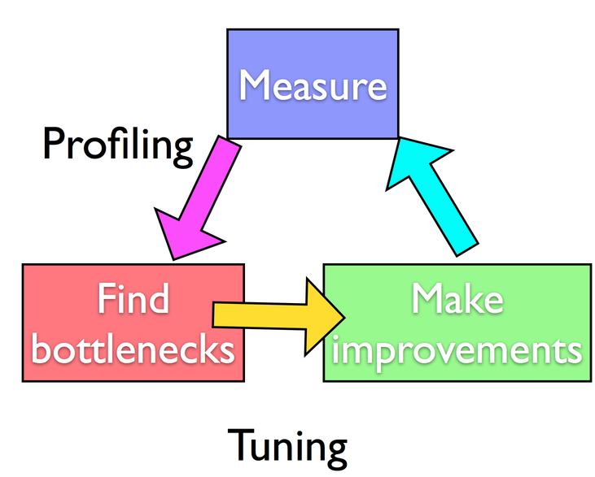

## Profiling Tools
* Here we'll focus on profiling.
* Tuning - each problem might have different sorts of performance problem
* Tools are general
* Range of tools available for linux clusters

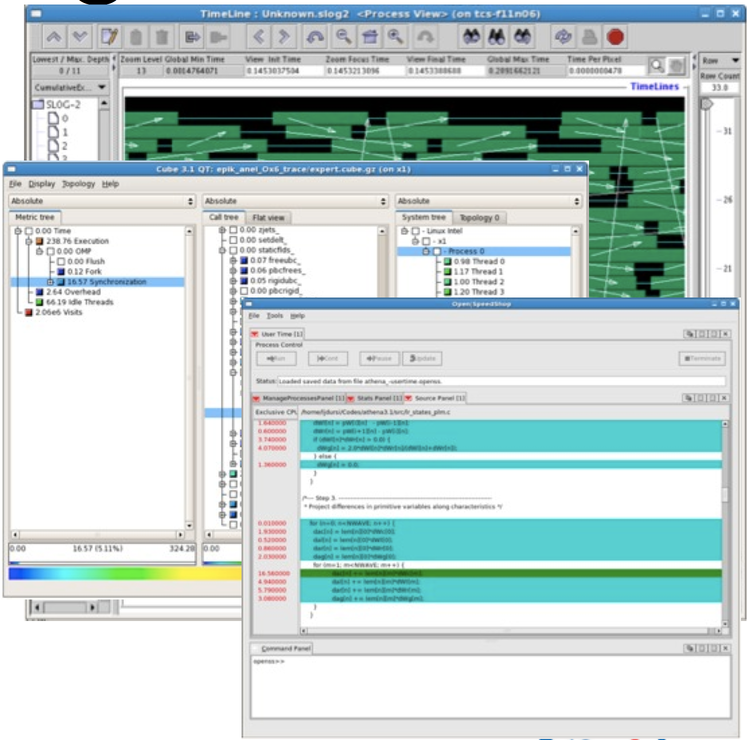

## Profiling A Code
* Where in your program is time being spent?
* Find the expensive parts
* Don't waste time optimizing parts that don't matter
* Find bottlenecks.

## Profiling A Code
* Timing vs. Sampling vs.  Tracing
* Instrumenting the code vs. Instrumentation-free

## Timing whole program
* Very simple; can run any command, incl in batch job

```
$ time ./a.out
[ your job output ]
real 0m2.448s
user 0m2.383s
sys 0m0.027s
```

* `real` = Elapsed "walltime"
* `user` = Actual time in user code
* `sys` = System time: Disk, I/O...
* In serial, real = user+sys
* In parallel, ideally user = (nprocs)x(real)


## Time in PBS *.o file

* Note under "resources"
* Measured CPU time (and total memory, and w)

```
---------------------------------------
Begin PBS Prologue Tue Sep 14 17:14:48 EDT 2010 1284498888
Job ID: 3053514.gpc-sched
Username: ljdursi
Group: scinet
Nodes: gpc-f134n009 gpc-f134n010 gpc-f134n011 gpc-f134n012
gpc-f134n043 gpc-f134n044 gpc-f134n045 gpc-f134n046 gpc-f134n047 gpc-f134n048
[...]
End PBS Prologue Tue Sep 14 17:14:50 EDT 2010 1284498890
---------------------------------------
[ Your job's output here... ]
---------------------------------------
Begin PBS Epilogue Tue Sep 14 17:36:07 EDT 2010 1284500167
Job ID: 3053514.gpc-sched
Username: ljdursi
Group: scinet
Job Name: fft_8192_procs_2048
Session: 18758
Limits: neednodes=256:ib:ppn=8,nodes=256:ib:ppn=8,walltime=01:00:00
Resources: cput=713:42:30,mem=3463854672kb,vmem=3759656372kb,walltime=00:21:07
Queue: batch_ib
Account: Nodes: gpc-f134n009 gpc-f134n010 gpc-f134n011 gpc-f134n012 gpc-f134n043
[...]
Killing leftovers...
gpc-f141n054:
killing gpc-f141n054 12412
End PBS Epilogue Tue Sep 14 17:36:09 EDT 2010 1284500169
----------------------------------------
```

## Can use 'top' on running jobs

```
$ checkjob 3802660
[...]
Allocated Nodes:
[gpc-f109n001:8][gpc-f109n002:8]

$ ssh gpc-f109n001
gpc-f109n001-$ top
```
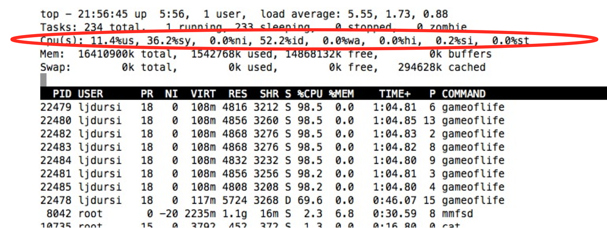

Even this quick status shows something:

 * More system then user time -- not very efficient.
 * (Idle ~50% is ok -- hyperthreading)
 * Also, load-balance issues; one processor underutilized (~70% use as vs 98.2%)

## Insert timers into regions of code
* Instrumenting code
* Simple, but incredibly useful
* Runs every time your code is run
* Can trivially see if changes make things better or worse

## Timers: C

```
#include <sys/time.h>

    /*...*/
	
    struct timeval calc;
    
     tick(&calc);
     /* do work */
     calctime = tock(&calc);
     
     printf("Timing summary:\n");
     /* other timers */
     printf("Calc: %8.5f\n", calctime);
     
    /*...*/

     
void tick(struct timeval *t) {
    gettimeofday(t, NULL);
}
 
double tock(struct timeval *t) {
    struct timeval now;
    gettimeofday(&now, NULL);
    return (double)(now.tv_sec - t->tv_sec) + ((double)(now.tv_usec - t->tv_usec)/1000000.);
}
```

## Timers: C++11

```
  #include <chrono>

  auto start = chrono::steady_clock::now();
  // do work
  auto end = chrono::steady_clock::now();

  // Store the time difference between start and end
  auto diff = end - start;
  std::cout << "Calc: " << diff << std::endl;
  
```

## Timers: Modern Fortran

```
subroutine tick(t)
    integer, intent(OUT) :: t
 
    call system_clock(t)
end subroutine tick
 
! returns time in seconds from now to time described by t 
real function tock(t)
    integer, intent(in) :: t
    integer :: now, clock_rate
 
    call system_clock(now,clock_rate)
 
    tock = real(now - t)/real(clock_rate)

 call tick(calc)
!  do big calculation
 calctime = tock(calc)
 
 print *,'Timing summary'
 print *,'Calc: ', calctime
 
```
 
## Example: Matrix-Vector multiply
* Simple matrix vector multiply
* Initializes data, does multiply, saves result
* Let's use timers, look to see where it spends its time, speed it up.
* Options for how to access data, output data.

## Matrix-Vector multiply
* Can get an overview of the time spent easily, because we instrumented our code (~12 lines!)
* I/O huge bottleneck.

```
$ make mvm
$ mvm --matsize=2500
Timing summary:
Init: 0.00952 sec
Calc: 0.06638 sec
I/O : 5.07121 sec

$ du -h Mat-vec.dat
89M
```

## Matrix-Vector multiply
* I/O being done in ASCII
* Have to loop over data, convert to string, write to output.
* 6,252,500 write operations!
 
```
        out = fopen("Mat-vec.dat","w");
        fprintf(out,"%d\n",size);

        for (int i=0; i<size; i++)
            fprintf(out,"%f ", x[i]);

        fprintf(out,"\n");

        for (int i=0; i<size; i++)
            fprintf(out,"%f ", y[i]);

        fprintf(out,"\n");

        for (int i=0; i<size; i++) {
            for (int j=0; j<size; j++) {
                fprintf(out,"%f ", a[i][j]);
            }
            fprintf(out,"\n");
        }
        fclose(out);
```

## Matrix-Vector multiply
* Let's try a --binary option:
* Shorter
 
```
        out = fopen("Mat-vec.dat","wb");
        fwrite(&size, sizeof(int),   1,         out);
        fwrite(x,     sizeof(float), size,      out);
        fwrite(y,     sizeof(float), size,      out);
        fwrite(&(a[0][0]),     sizeof(float), size*size, out);
        fclose(out);
```
* Faster

```
Binary I/O
$ mvm --matsize=2500 --binary

Timing summary:Init: 0.00976 sec
Calc: 0.06695 sec
I/O : 0.14218 sec
```
* Much (36x!) faster.
* And output ~4x smaller (as vs 89M).

```
$ du -h Mat-vec.dat
20M
```
* Still slow, but writing to disk is slower than a multiplication.
* On to Calc - will want fine-grained information.

## Sampling for Profiling

* How to get finer-grained information about where time is being spent?
* Can't instrument every single line.
* Compilers have tools for sampling execution paths.

## Program Counter Sampling
* As program executes, every so often (~100ms) a timer goes off, and the current location of execution is recorded
* Shows where time is being spent.

* Advantages:
    - Very low overhead
    - No extra instrumentation
* Disadvantages:
    - Don't know why code is there
    - Statistics - have to run long enough job

## gprof for sampling
```
$ gcc -O3 -pg -g mat-vec-mult.c --std=c99
$ icc -O3 -pg -g mat-vec-mult.c -c99
```

* `-pg`: profiling
* `-g`: turn on debugging symbols (optional, but more useful)

```
$ ./mvm-profile --matsize=2500
[output]
$ ls
Makefile       Mat-vec.dat gmon.out
mat-vec-mult.c mvm-profile
```

## gprof examines gmon.out

```
$ gprof mvm-profile gmon.out
Flat profile:
Each sample counts as 0.01 seconds.
  %   cumulative   self              self     total
 time   seconds   seconds    calls  Ts/call  Ts/call  name
100.26      0.09     0.09                             main
  0.00      0.09     0.00        3     0.00     0.00  tick
  0.00      0.09     0.00        3     0.00     0.00  tock
  0.00      0.09     0.00        2     0.00     0.00  alloc1d
  0.00      0.09     0.00        1     0.00     0.00  alloc2d
  0.00      0.09     0.00        1     0.00     0.00  free2d
  0.00      0.09     0.00        1     0.00     0.00  get_options
```
Gives data by function -- usually handy,
not so useful in this toy problem

## gprof --line examines gmon.out by line

```
gpc-f103n084-$ gprof --line mvm-profile gmon.out
Each sample counts as 0.01 seconds.
  %   cumulative   self              self     total
 time   seconds   seconds    calls  Ts/call  Ts/call  name
 66.84      0.06     0.06                             main (mat-vec-mult.c:84 @ 401268)
 11.14      0.07     0.01                             main (mat-vec-mult.c:63 @ 401080)
 11.14      0.08     0.01                             main (mat-vec-mult.c:114 @ 401370)
 11.14      0.09     0.01                             main (mat-vec-mult.c:115 @ 401390)
  0.00      0.09     0.00        3     0.00     0.00  tick (mat-vec-mult.c:161 @ 400b30)
  0.00      0.09     0.00        3     0.00     0.00  tock (mat-vec-mult.c:166 @ 400b50)
  0.00      0.09     0.00        2     0.00     0.00  alloc1d (mat-vec-mult.c:154 @ 400b00)
  0.00      0.09     0.00        1     0.00     0.00  alloc2d (mat-vec-mult.c:132 @ 400a30)
  0.00      0.09     0.00        1     0.00     0.00  free2d (mat-vec-mult.c:146 @ 400ad0)
  0.00      0.09     0.00        1     0.00     0.00  get_options (mat-vec-mult.c:179 @ 400bc0)
```

* Then can compare to source
* Code is spending most time deep in loops
* (line 84)- multiplication 
* (line 63) - initialization
* (line 63)- I/O (text output)

```
 82         for (int j=0; j<size; j++) {
 83             for (int i=0; i<size; i++) {
 84                 y[i] += a[i][j]*x[j];
 85             }
 86         }
```
 
and

```
113         for (int i=0; i<size; i++) {
114             for (int j=0; j<size; j++) {
115                 fprintf(out,"%f ", a[i][j]);
116             }
117             fprintf(out,"\n");
118         }
```

## gprof pros/cons
* Exists everywhere
* Easy to script, put in batch jobs
* Low overhead
* Works well with multiple processes thread data all gets clumped together
* 1 file per proc (good for small P, but hard to compare)

## Open|Speedshop
* GUI containing several different ways of doing performance experiments
* Includes
	- pcsamp (like gprof - by function)
	- usertime (by line of code and callgraph),
	- I/O tracing,
	- MPI tracing.
* Can run either in a sampling mode, or instrumenting/tracing ('online' mode automatically instruments the binary).

## Open|Speedshop

```
$ module load openspeedshop
$ openss
```
launches an experiment wizard

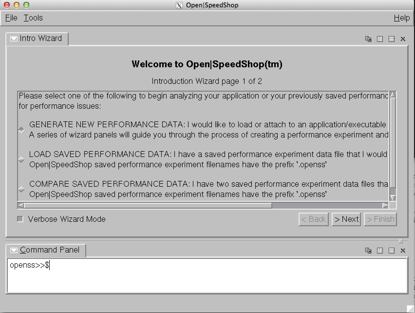

* There are different experiments that you can run -- pcsamp is like gprof
* It will show top functions (or statements) by default; doubleclicking takes to source line.

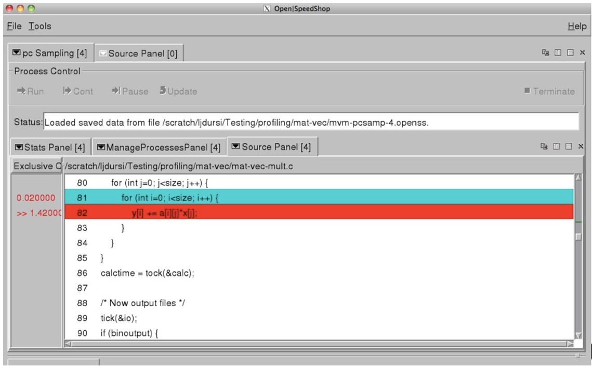

## Open|Speedshop - Compare Experiments

It will also let you compare
experiments. Here we try two ways
of doing the matrix multiplication; the
first (line 82) requires .06 seconds,
the second (line 74) requires only
0.01 -- a 6x speedup!

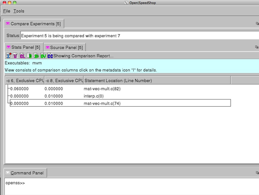


## Cache Thrashing
* Memory bandwidth is key to getting good performance on modern systems
* Main Mem - big, slow
* Cache - small, fast
* Saves recent accesses, a line of data at a time
* When accessing memory in order, only one access to slow main mem for many data points - additional accesses within that cache line (~64B) is free
* Much faster (~1ns to access cache, ~100ns to access main memory)
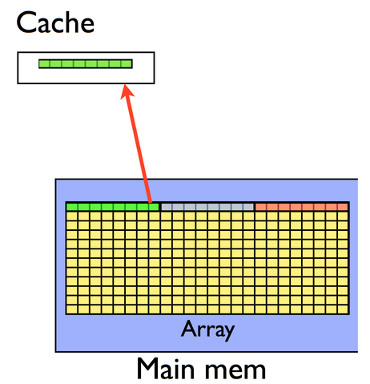

## Cache Thrashing

* When accessing memory out of order, much worse
* Each access is new cache line (cache miss)
	- slow access to main memory
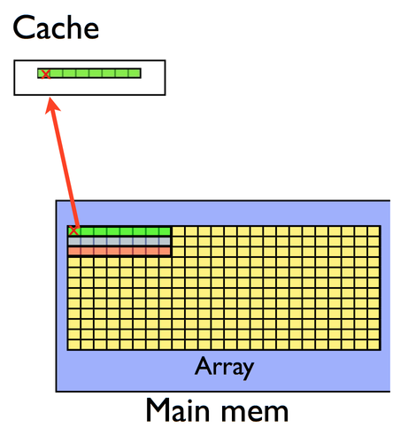

## Valgrind and kcachegrind
* Tools like valgrind can measure cache performance
* Then use kcachegrind to see graphical results

```
$ valgrind --tool=cachegrind ./mvm --matsize=2500
$ kcachegrind cachegrind.out.20275
```

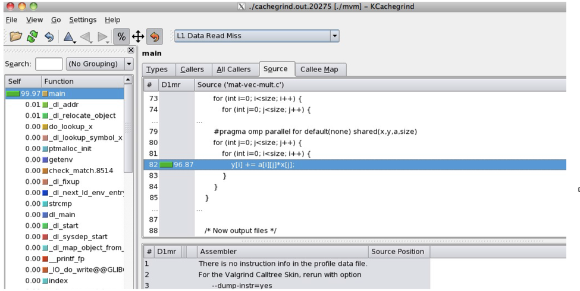

## Cache Performance
* In C, cache-friendly order is to make last index most quickly varying

```
        /* Good */
        for (int i=0; i<size; i++) {
            for (int j=0; j<size; j++) {
                y[i] += a[i][j]*x[j];
            }
        }
        /* Bad */
        for (int j=0; j<size; j++) {
            for (int i=0; i<size; i++) {
                y[i] += a[i][j]*x[j];
            }
        }
```


* In Fortran, cache-friendly order is to make first index most quickly varying

```
    ! Good
    do j=1,size
    	do i=1,size
    	    y(i) = y(i) + a(i,j) * x(j)
    	enddo
    enddo
    
    ! Bad
    do i=1,size
    	do j=1,size
    	    y(i) = y(i) + a(i,j) * x(j)
    	enddo
    enddo
```

* But in this case better still to just use `y = matmul(a,x)`.
* Always use optimized routines when available instead of rolling your own!


* Once cache thrashing is fixed (by transposing the order of the loops), OpenMP-ing the loop works fairly well -- but now initialization is a bottleneck.
* (Amdahl's law)

```
gpc-f103n084-$ export OMP_NUM_THREADS=1
gpc-f103n084-$ ./mvm-omp --matsize=2500 --transpose --binary
Timing summary:
 Init: 0.00947 sec
 Calc: 0.00811 sec
 I/O : 0.14881 sec
gpc-f103n084-$ export OMP_NUM_THREADS=2
gpc-f103n084-$ ./mvm-omp --matsize=2500 --transpose --binary
Timing summary:
 Init: 0.00986 sec
 Calc: 0.00445 sec
 I/O : 0.01558 sec
```


* Tuning is iterative!
* Under Load Balance Overview, can also give top lines
and their min/average/max time spent by thread.
* Good measure of load balance -- underused threads?
* Here, all #s equal -- very good load balance

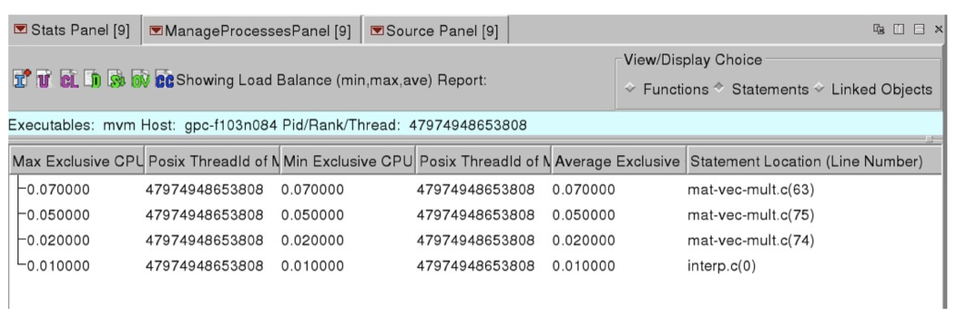

## Open|Speedshop
* Also has very powerful UNIX command line tools
```
openss -f `./mvm --transpose pcsamp
```

* and python scripting interface.
* Experiments: pcsamp (gprof), usertime (includes call graph), iot (I/O tracing - find out where I/O time is being spent), mpit (MPI tracing)

## Game of Life
* Simple MPI implementation of Conway game of life
- Live cell with 2,3 neighbours lives;
- 0-1 starves;
- 4+ dies of overcrowding
* Empty cell w/ 3 neighbours becomes live

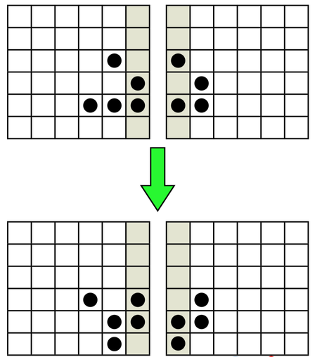

## IPM

* Integrated Performance Monitor
* Integrates a number of low-overhead counters for performance measurements of parallel codes (particularly MPI)
* Only installed for gcc+openmpi for now

```
$ module load ipm

$ export LD_PRELOAD=${SCINET_IPM_LIB}/libipm.so
$ mpirun ./gameoflife --infilename=bigin.txt
[generates big file with ugly name]
$ export LD_PRELOAD=
$ ipm_parse -html [uglyname]
```

* Overview: global stats, % of MPI time by call, buffer size

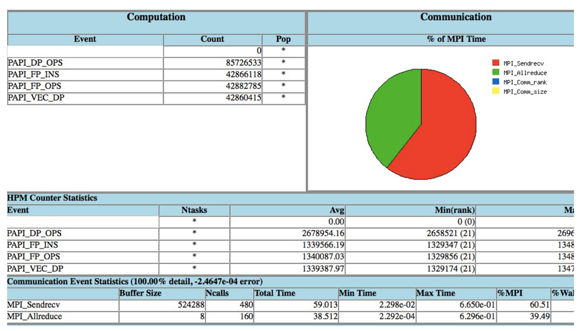

* Load balance view: Are all tasks doing same amount of work?

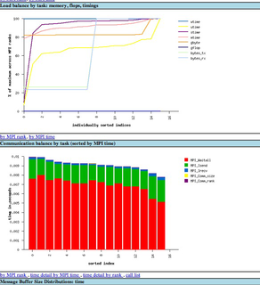

* Distribution of time, # of calls by buffer size (here -- all very small messages!)

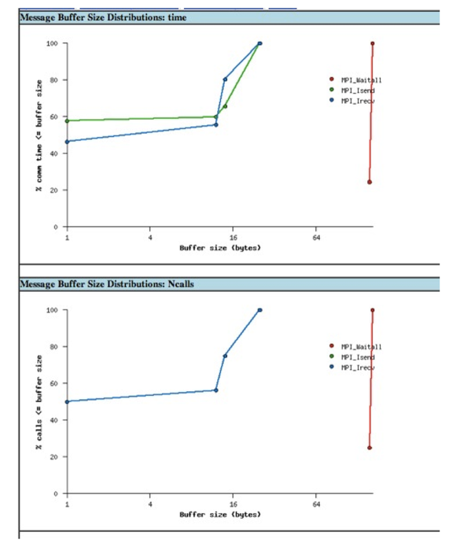

* Communications patterns, total switch traffic (I/O + MPI)

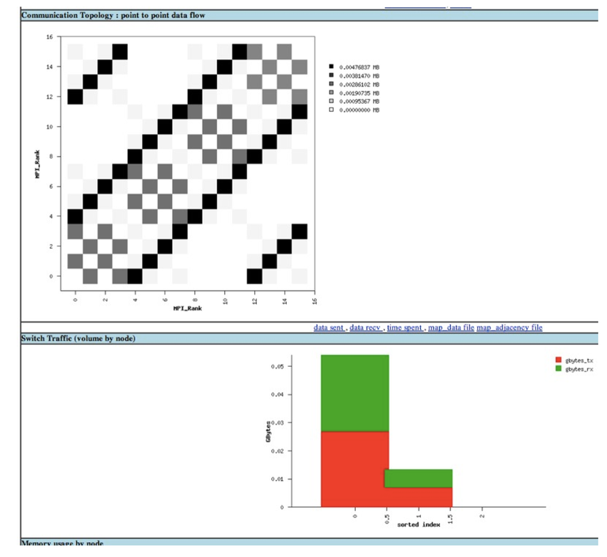

## MPE/Jumpshot
* More detailed view of MPI calls
* Rather than just counting, actually logs every MPI call, can then be visualized.
* Higher overhead - more detailed data.

```
$ module load mpe
$ mpecc -mpilog -std=c99 gol.c -o gol
$ mpirun -np 8 ./gol
$ clog2TOslog2 gol.clog2
$ jumpshot gol.slog2
```

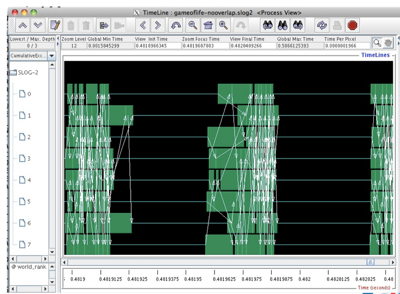

## Overlapping communication & Computation:
Much less synchronized (good); but shows poor load
balance

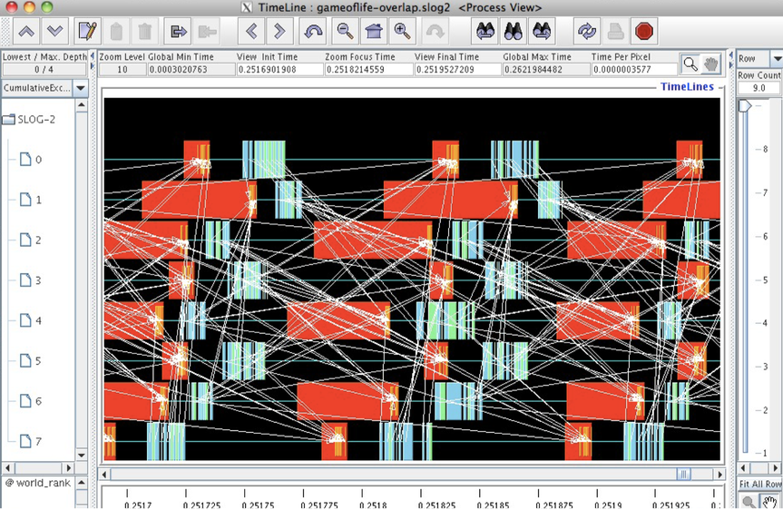

## Scalasca - Analysis
* Low-level automated instrumentation of code.
* High-level analysis of that data.
* Compile, run as normal, but prefix with:
    - compile: `scalasca -instrument`
    - run: `scalasca -analyze`
    - Then `scalasca -examine` the resulting directory.

* Game of life: can take a look at data sent, received
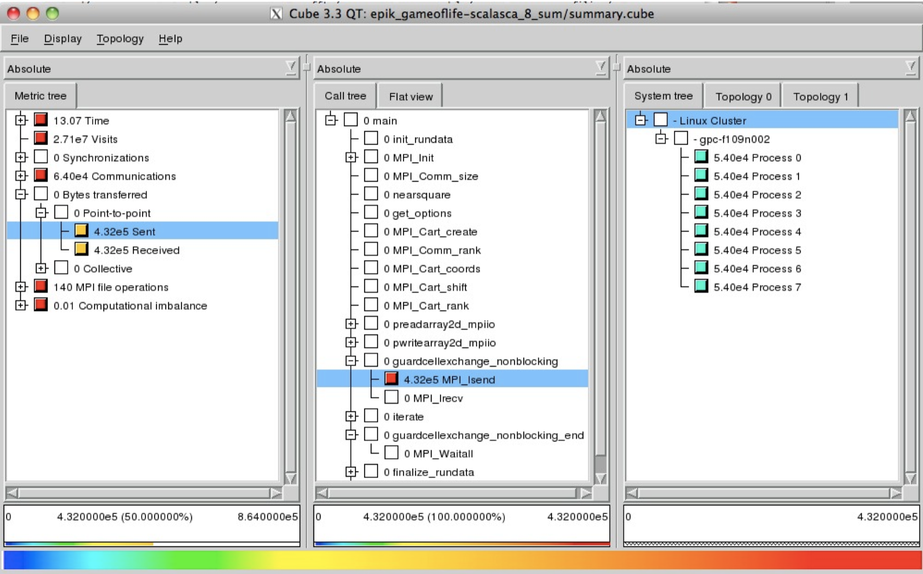
* Can also see load imbalance -- by function, process
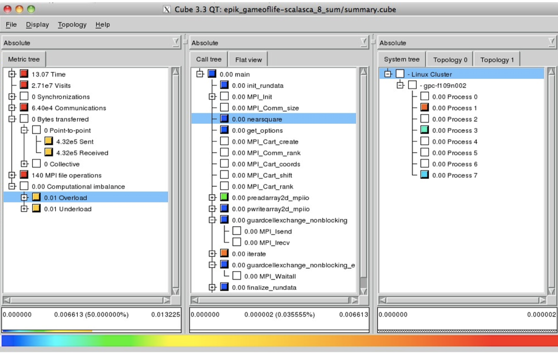
* MVM - can show where threads are idle
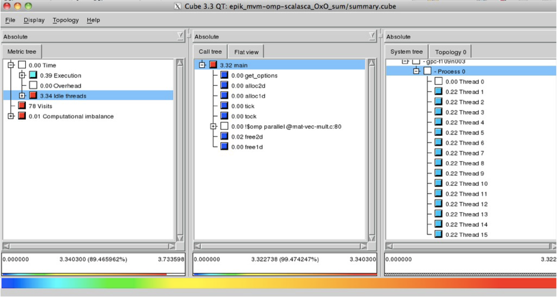
(Thread 0 doing way too much work!)

## Commercial Options
* Intel Trace Analyzer/Collector -- for MPI, like jumpshot + IPM. A little easier to use
* Intel Vtune -- good thread performance analyzer

## Summary
*  Use output .o files, or time, to get overall time - predict run time, notice if anything big changes
* Put your own timers in the code in important sections, find out where time is being spent
* if something changes, know in what section

## Summary
* Gprof, or openss, are excellent for profiling serial code
* Even for parallel code, biggest wins often come from serial improvements
* Know important sections of code
* valgrind good for cache performance, memory checks.

## Summary
* Basically all MPI codes should be run with IPM
* Very low overhead, gives overview of MPI performance
* See communications structure, message statistics

## Summary
* OpenMP/pthreads code - Open|SpeedShop good for load balance issues
* MPI or OpenMP - Scalasca gives very good overview, shows common performance problems.


